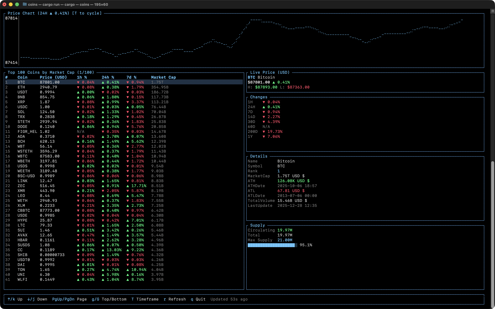

# 🪙 Coins

A beautiful terminal-based cryptocurrency price tracker built with Rust. Displays real-time prices for the top 100 cryptocurrencies by market cap using the CoinGecko API.




## ✨ Features

- 📊 **Top 100 Coins** - View the top 100 cryptocurrencies ranked by market cap
- 📈 **Interactive Price Chart** - Sparkline chart with 1H/24H/7D timeframes
- 💹 **Price Changes** - Track price movements across 8 timeframes (1H, 24H, 7D, 14D, 30D, 60D, 200D, 1Y)
- 📋 **Detailed Info** - Market cap, ATH/ATL, volume, and more
- 💰 **Supply Data** - Circulating, total, and max supply with visual progress bar
- 🔄 **Auto-Refresh** - Automatic updates every 60 seconds
- ⌨️ **Keyboard Navigation** - Full keyboard control with vim-style bindings
- 🎨 **Beautiful TUI** - Modern terminal UI with colors and Unicode charts

## 📦 Installation

### Pre-built Binaries (Recommended)

Download the latest release for your platform from the [Releases](https://github.com/dongri/coins/releases) page.

#### macOS

```bash
# Download and extract
curl -L https://github.com/dongri/coins/releases/latest/download/coins-macos-arm64.tar.gz | tar xz

# Move to PATH
sudo mv coins /usr/local/bin/

# Verify installation
coins --version
```

#### macOS (Intel)

```bash
curl -L https://github.com/dongri/coins/releases/latest/download/coins-macos-x64.tar.gz | tar xz
sudo mv coins /usr/local/bin/
```

#### Linux

```bash
curl -L https://github.com/dongri/coins/releases/latest/download/coins-linux-x64.tar.gz | tar xz
sudo mv coins /usr/local/bin/
```

#### Windows

Download `coins-windows-x64.zip` from the [Releases](https://github.com/dongri/coins/releases) page, extract it, and add the directory to your PATH.

### Using Homebrew (macOS/Linux)

```bash
brew tap dongri/tap
brew install coins
```

### Using Cargo (Rust Required)

If you have Rust installed:

```bash
cargo install --git https://github.com/dongri/coins
```

### Build from Source

```bash
# Clone the repository
git clone https://github.com/dongri/coins.git
cd coins

# Build and install
cargo install --path .
```

## 🚀 Usage

Simply run:

```bash
$ coins
```

The application will start and display the cryptocurrency dashboard.

## ⌨️ Keyboard Controls

| Key | Action |
|-----|--------|
| `↑` / `k` | Move selection up |
| `↓` / `j` | Move selection down |
| `PgUp` | Page up |
| `PgDn` | Page down |
| `g` | Go to top |
| `G` | Go to bottom |
| `T` | Cycle chart timeframe (1H → 24H → 7D) |
| `r` | Manual refresh |
| `q` / `Esc` | Quit |
| `Ctrl+C` | Force quit |


## 📊 Data Sections

### Price Chart
- Interactive sparkline chart showing price history
- Toggle between 1H, 24H, and 7D views with `T` key
- Shows current change percentage in the title

### Coin Table
- Rank, Symbol, Current Price
- 1H, 24H, 7D percentage changes
- Market Cap

### Live Price
- Current price with 24H change
- 24H High and Low prices

### Changes
- Price change percentages for 8 timeframes
- Visual indicators (▲ green for up, ▼ red for down)

### Details
- Name, Symbol, Rank
- Market Cap, Total Volume
- ATH (All-Time High) and ATL (All-Time Low) with dates
- Last update timestamp

### Supply
- Circulating Supply
- Total Supply
- Max Supply (or ∞ for unlimited)
- Visual progress bar showing supply ratio

## 🔧 Configuration

The application uses the CoinGecko Public API (no API key required).

### Data Refresh
- Auto-refresh interval: 60 seconds
- Manual refresh: Press `r`

### Currency
- Currently displays in USD
- Future versions may support other currencies

## 🛠️ Building Release Binaries

To build optimized release binaries for distribution:

```bash
# Build for current platform
cargo build --release

# The binary will be at ./target/release/coins
```

### Cross-compilation

For cross-platform builds, we recommend using GitHub Actions. See `.github/workflows/release.yml` for an example workflow.

## 📝 API

This tool uses the [CoinGecko API](https://www.coingecko.com/en/api) (free, no API key required).

### Rate Limits
- CoinGecko's public API has rate limits
- The 60-second refresh interval respects these limits
- If you see errors, wait a moment and press `r` to retry

## 🤝 Contributing

Contributions are welcome! Please feel free to submit a Pull Request.

1. Fork the repository
2. Create your feature branch (`git checkout -b feature/amazing-feature`)
3. Commit your changes (`git commit -m 'Add some amazing feature'`)
4. Push to the branch (`git push origin feature/amazing-feature`)
5. Open a Pull Request

## 📄 License

This project is licensed under the MIT License - see the [LICENSE](LICENSE) file for details.

## 👤 Author

**Dongri Jin** ([@dongri](https://github.com/dongri))

## 🙏 Acknowledgments

- [CoinGecko](https://www.coingecko.com/) for providing the free cryptocurrency API
- [ratatui](https://github.com/ratatui-org/ratatui) for the excellent TUI library
- The Rust community for amazing tools and libraries
